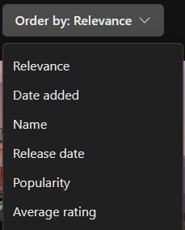
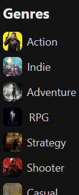
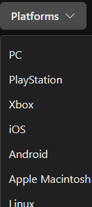
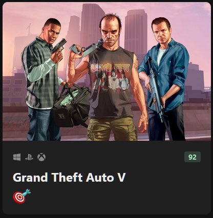
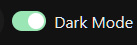

# Game Hub

Welcome to Game Hub! Visit my live website at http://gamehub.jennypatel.dev/

This projects has a variety of games for a gamer. It has various ways to sort, filter and search a game. We can filter a game by Genre and Platform. It can also be sorted by Relevance, Popularity, name and various other ways. Also, a user can directly search his favourite game from the search bar.

This project uses React as Frontend library which is styled by Chakra UI one of the most popular UI Library. It gets its data from RAWG.

## How to install the project

1. Clone the repository to your local machine.
    
    `git clone https://github.com/JennyP21/game-hub.git`

2. Navigate to the project directory.

    `cd game-hub`

3. Install the project dependencies.

    `npm i` or `npm install`

4. Run the development server.

    `npm run dev`

**Project will run on `https://localhost:5173/`**

## Key Features:

#### (1) Sorting Games

   

#### (2) Filter by Genre

   

#### (3) Filter by Platforms

   

#### (4) Project Card with details about the game.

   

#### (5) Change your website to either light or dark theme.

   

### Credit

This project was built with the help of Mosh Hamedani in his newest React course.

Link to course site https://codewithmosh.com/
